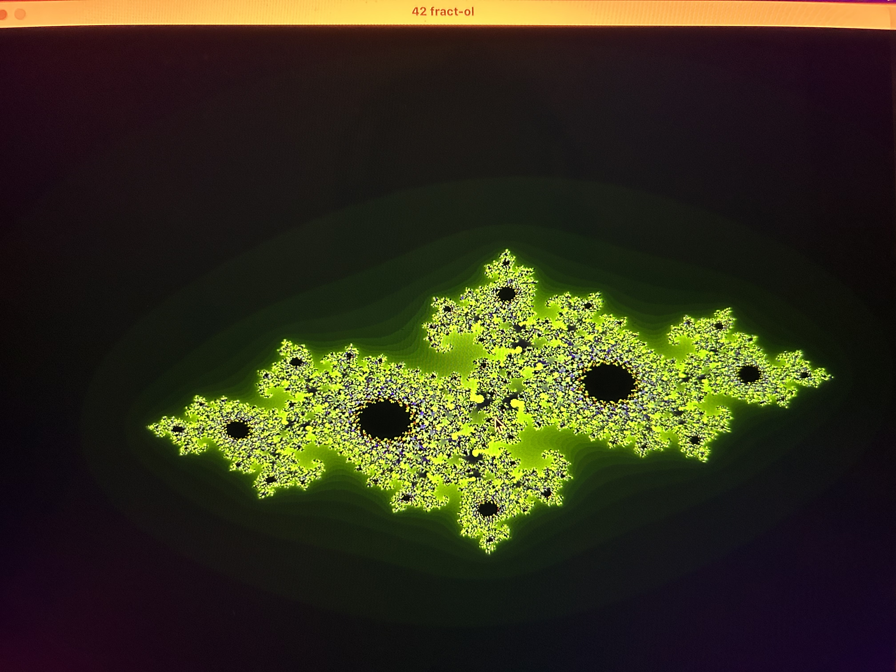

# FRACT-OL
> FRACT-OL is an introduction project into computer graphics using the intricate mathematical construct known as fractals.

 

## Table of Contents
* [General Info](#general-information)
* [Features](#features)
* [Screenshots](#screenshots)
* [Setup](#setup)
* [Usage](#usage)

## General Information
- The task involves utilizing 42's graphical library, MiniLibX, which provides fundamental tools for creating images, opening windows, and handling different keyboard and mouse events.
-  By building fract-ol I had the chance to gain familiarity with MiniLibX, explore the mathematical concept of complex numbers and delve into optimization in computer graphics.

## Features
- Creating both Mandelbrot and Julia sets
- Possibility to provide different c numbers for Julia sets 
- Customizing different color shemes, black and white, hue saturated value, green.

## Screenshots

## Setup
Requirements are:
- macOS with Intel chip

## Usage
`make && ./fractol julia`

`make && ./fractol mandelbrot`

